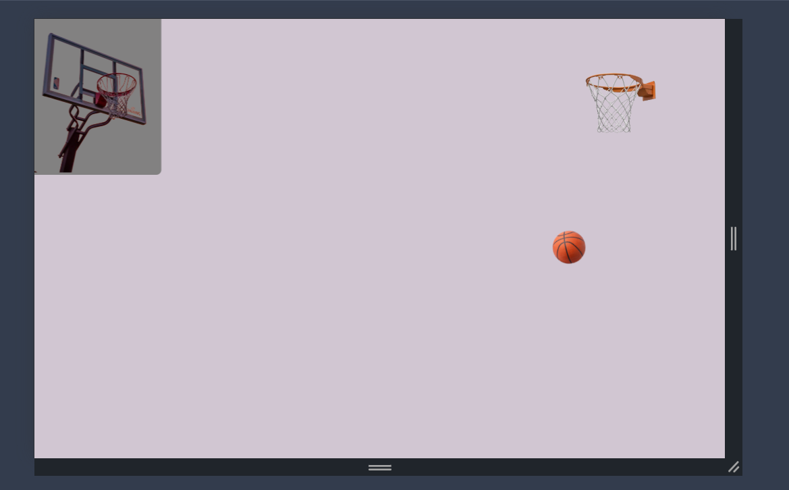

# 🏀 Basketball Game

Welcome to **Basketball Game**! This is a fun and interactive basketball game where players can shoot hoops, score points, and compete for the highest score. Whether you're a casual gamer or a basketball enthusiast, this game is designed to bring an exciting experience.

## 📸 Screenshots
Add your game screenshots here to showcase the gameplay.

## 🎮 Features
- 🏆 **Multiple Game Modes**: Free play, time challenge, and high-score mode.
- 🎯 **Realistic Physics**: Enjoy smooth and natural ball movement.
- 🎨 **Cool Graphics**: A visually appealing basketball court and animations.
- 🎵 **Sound Effects**: Enjoy the sounds of bouncing balls and cheering crowds.
- 📊 **Score Tracking**: Keep track of your best scores and challenge yourself!

## 🕹️ How to Play
1. Launch the game using the installation steps above.
2. Use your mouse or keyboard (depending on the game) to aim and shoot the ball.
3. Score as many baskets as possible before the timer runs out!
4. Try to beat your high score and challenge friends!

## 🚀 Technologies Used
- **Game Engine**: Unity / Phaser / Pygame (whichever applies)
- **Programming Language**: HTML / CSS / JavaScript
- **Graphics**: Custom sprites and animations

## 🤝 Contributing
Contributions are welcome! If you’d like to improve the game, follow these steps:
1. Fork the repository.
2. Create a new branch: `git checkout -b feature-new`.
3. Make your changes and commit: `git commit -m 'Added a new feature'`.
4. Push to your branch: `git push origin feature-new`.
5. Submit a pull request!

## 📬 Contact
For any questions or suggestions, feel free to reach out:
- Email: faridunfakhridinov777@gmail.com
- GitHub: [Faridun11](https://github.com/Faridun11)

Enjoy the game and have fun shooting hoops! 🏀🔥

